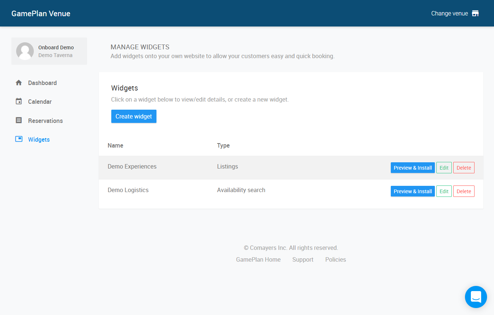
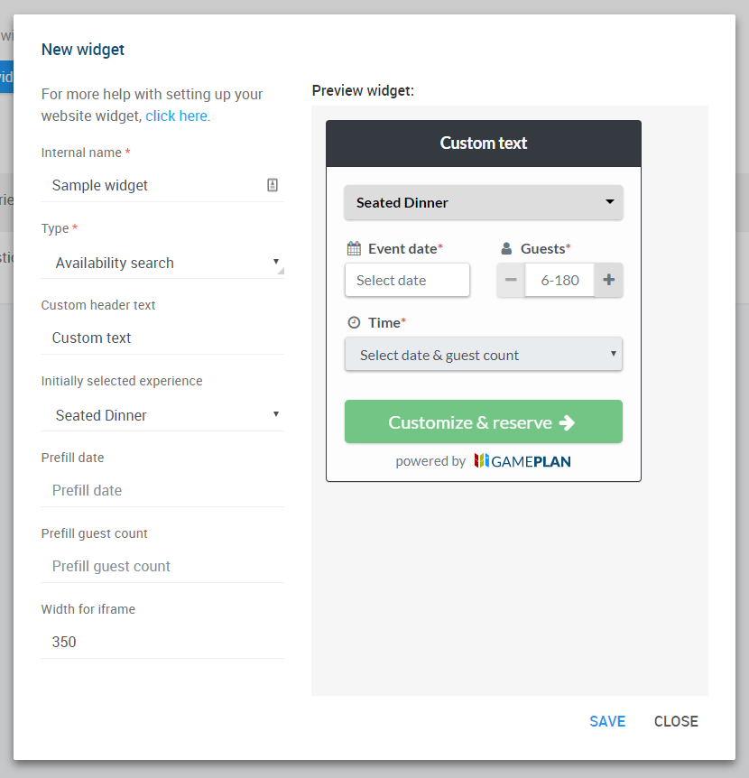
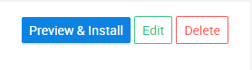
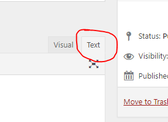
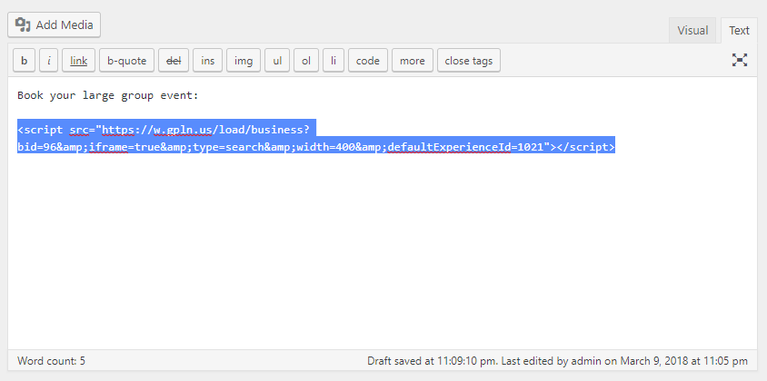

### Your guests are finding you online – why wait to capture their business?
Busy event organizers are using the internet to research venues for their large parties every day. With GamePlan’s group dining reservation technology, you can be the first to present your event offerings and banquet packages, offer a quote, and convert visitors to bookings – all automated, and all on your own website.

GamePlan's booking widget allows visitors to view your rooms & menus, check availability, generate price quotes, and book online with a credit card guarantee.

Follow the instructions below to add the booking widget to your website. If you're not already using GamePlan at your venue, chat with us or email venues@getgameplan.com today to get started.

### Step 1: Generate your booking widget code
You can create a new widget by logging into your [Venue Dashboard](https://venue.getgameplan.com) and selecting the "Widgets" section.

Any existing widgets you've created will be listed, which you can edit or preview and get the installation code. Click "Create widget" to make a new widget.

The widget creation interface gives you all of the available options for customization and shows you a preview of what your widget will look like. Once you're happy with how it looks, click "Save".

Then, find your new widget in the list and click "Preview & Install" to get the HTML code to install on your site.

***TIP:*** You can come back and edit your widget at anytime, without needing to change the code on your website.

### Step 2: Insert the widget code on your page
The widget code should be inserted in your website code in the actual position you want it to appear. If you have the ability to edit the HTML source code of your webpages, simply insert the code provided in the appropriate spot.

#### WordPress-specific instructions
You can insert your widget in the content of any post or page. Just edit the page you wish to add the widget to and switch your editor to the "Text" mode.

Then, find the place in your content you wish to insert the widget and paste the code snippet on its own line as follows.

Finally, save your post or page. That's it - the GamePlan booking widget will now appear on your page!

### Advanced customization options
The installation code generated includes a unique ID that refers to the specific widget you created in the Venue Dashboard. While the customization options can be edited at any time without updating your website code, you can also override these parameters manually in the URL by adding query parameters.

You can add the following query parameters to the script source URL to override their settings:

- `width` : A fixed width to use for the widget in pixels. If you omit the width  parameter, the widget will default to 100% of the width of its container.
- `defaultExperienceId`  *(Availability search widget only)*: If you have multiple listings for your location (e.g. Seated Meals, Receptions, and Happy Hours), you can specify the ID of the default listing selected in the search widget. The ID is the number after https://book.getgameplan.com/view/ in your listing URLs (your partner contact can help you with this if needed).
- `headerText`  *(Availability search widget only)*: Customize the title of the widget. If you exclude the headerText  parameter, the title will default to "View & reserve group dining options".
