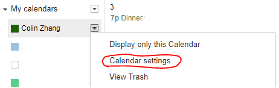
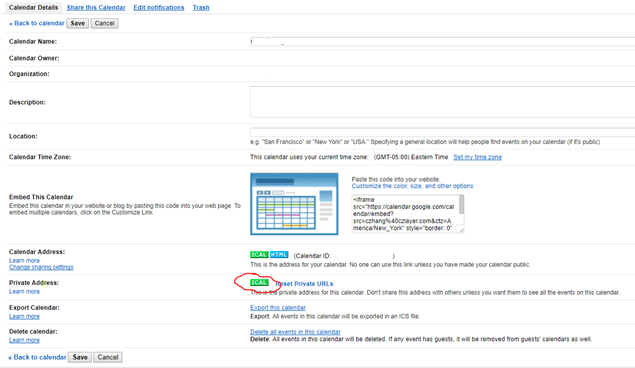
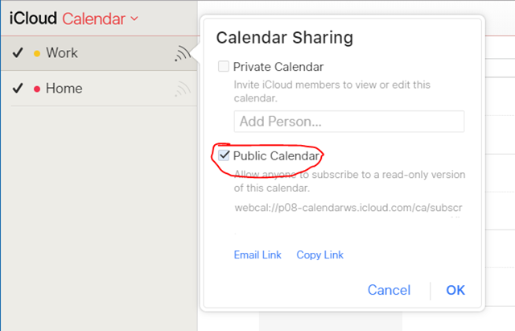
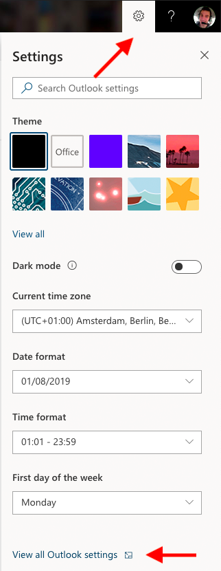
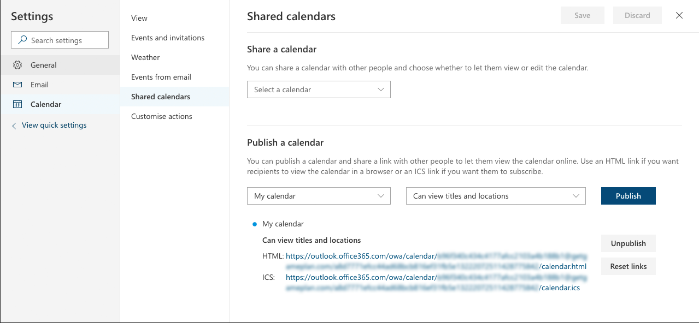
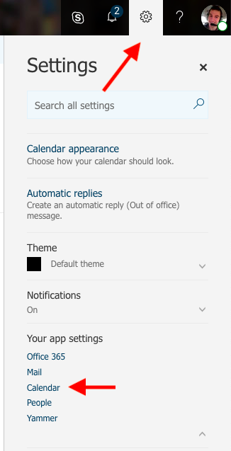
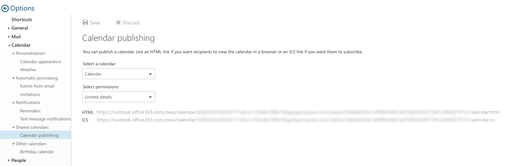

If you already use another calendar or event management tool to keep track of room availability, you may be able to "link" the bookings from that tool with GamePlan.

### Requirements
- We can use any publicly-accessible URL that provides a standard calendar feed (.ics or iCal format)
- Each calendar feed should represent ONE room only
- Each event in the calendar should represent a time that should be unavailable to book via GamePlan

Here's how to find this link by your provider.

### Google Calendar
Sign into [Google Calendar](https://calendar.google.com/) with the account your room calendar is synced to.

Click the arrow next to the calendar containing the room's bookings and select **Calendar settings**.

In the **Private Address** section of the screen, click on the **ICAL** icon, copy the URL provided, and send it to your account manager.

### iCloud
1. Go to [icloud.com](https://icloud.com) and sign in with the account your calendar is synced to.
2. Go to the **Calendar** section.
3. On the left side of the screen, click the icon next to the name of the calendar you are tracking your room's availability in. This will open the **Calendar Sharing** popup, as shown below.
4. Check the **Public Calendar** box, copy the link provided, and send it to your account manager for further setup.

### Office 365
Go to [outlook.office.com](https://outlook.office.com) and sign in with the account your calendar is synced to.

If your mailbox looks like

- the left image, see the instructions for the New look below
- the right image, see the instructions for the Classic look below

#### New look
1. Go to **Calendar** > **Shared calendars**
2. Under **Publish a calendar**, select the calendar containing the events for the room and set the permissions to '**Can view titles and locations**'
3. Click **Publish**
4. Use the **ICS** link

#### Classic look
1. Go to **Shared calendars** > **Calendar publishing**
2. Select the calendar containing the events for the room and set the permissions to '**Limited details**'
3. Click **Save**
4. Use the **ICS** link

### Tripleseat
Please contact your account manager for assistance.
