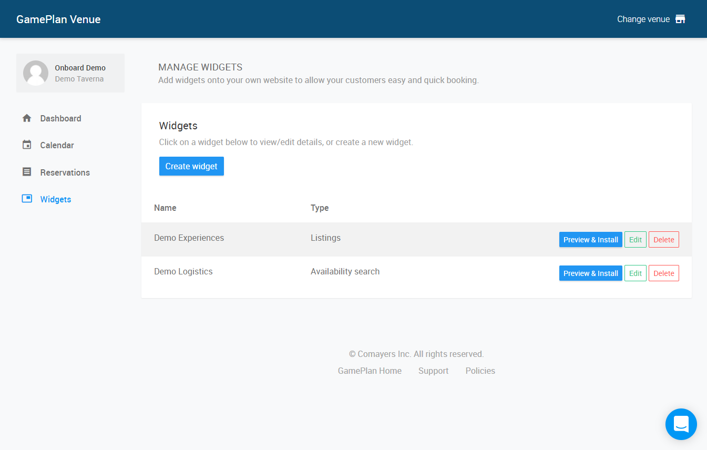
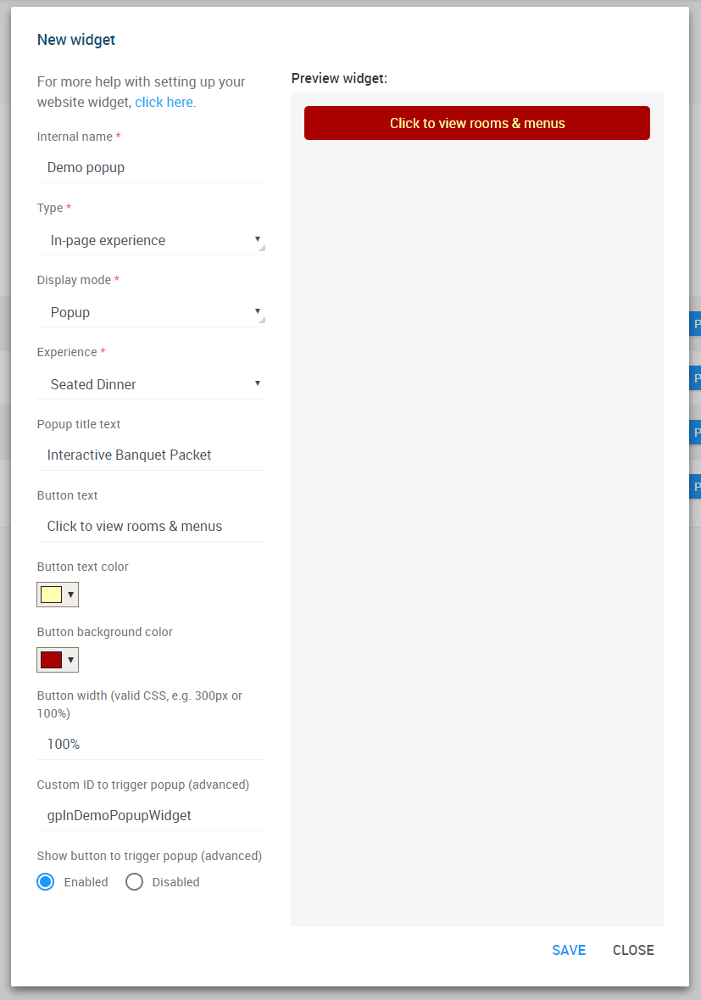
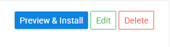
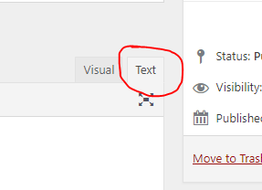
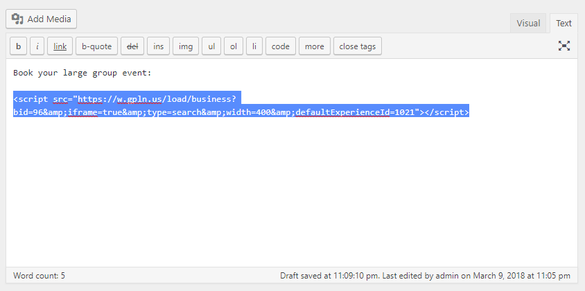

Every day, busy event organisers - and potential clients - are visiting your website looking for your group dining and event offerings.

GamePlan's booking widget allows visitors to view your rooms & menus, check availability, generate price quotes, and book online with a credit card guarantee - **and now, you can offer this experience built right into your website!**

Follow the instructions below to add the booking widget to your website. If you're not already using GamePlan at your venue, [email us](mailto:venues@getgameplan.com) or [schedule a demo](https://demo.getgameplan.com/) today to get started.

*Note: for help with other widget types, see [Adding the GamePlan booking widget to your website](../adding-the-gameplan-booking-widget-to-your-website).*

### Create your interactive banquet packet
#### Step 1: Generate your booking widget code
You can create a new widget by logging into your [Venue Dashboard](https://venue.getgameplan.com) and selecting the "**Widgets**" section.



Any existing widgets you've created will be listed, which you can edit or preview and get the installation code. Click "***Create widget***" to make a new widget. Select **In-page experience** for the type and **Popup** for the display mode.



The widget creation interface gives you all of the available options for customisation and shows you a preview of what your widget will look like. Once you're happy with how it looks, click "***Save***".



Then, find your new widget in the list and click "***Preview & Install***" to get the HTML code to install on your site.

***TIP***: You can come back and edit your widget at anytime, without needing to change the code on your website.

#### Step 2: Insert the widget code on your page
The widget code should be inserted in your website code in the actual position you want it to appear. If you have the ability to edit the HTML source code of your webpages, simply insert the code provided in the appropriate spot.

##### WordPress-specific instructions

You can insert your widget in the content of any post or page. Just edit the page you wish to add the widget to and switch your editor to the "Text" mode.



Then, find the place in your content you wish to insert the widget and paste the code snippet on its own line as follows.



Finally, save your post or page. That's it - the GamePlan booking widget will now appear on your page!

### Advanced customization options
#### Trigger the popup manually
By default, the widget includes a button to trigger the popup, with some options to customise its style. However, it is possible to use your own code to trigger the popup (e.g. for a link in your navigation bar, or if you want to make your own button).

To prevent the default button from being created, set the "***Show button to trigger popup***" option to disabled. Then, enter a "***Custom ID to trigger popup***", which will override the default CSS ID used by the widget code to identify the popup.

To trigger the popup on your page, insert the generated script code anywhere on your page (we recommend at the end of the `<body>` section of the HTML). Then, use Javascript (e.g. in an `onclick` handler or a function you call manually) to execute the following code:

```js
GPLN.Lightbox.Open('yourCustomID');
```

*Note: replace **yourCustomID** with the custom ID you entered in the widget settings. We recommend adding this code to an `<a>` element linking to your GamePlan listing page as a fallback in case the client has issues with Javascript.*

#### Override settings through the URL
The installation code generated includes a unique ID that refers to the specific widget you created in the Venue Dashboard. While the customisation options can be edited at any time without updating your website code, you can also override these parameters manually in the URL by adding query parameters.

You can add the following query parameters (special characters must be URL-encoded) to the script source URL to override their settings:

- `id`  (*string*): The custom ID to trigger the popup.
- `button`  (*boolean*): Whether to generate and show a button to trigger the popup. The button will be placed in the same position in the DOM as the script tag. Defaults to `true`.
- `buttonText`  (*string*): The text to display on the button.
- `buttonForeground`  (*string, valid CSS colour*): The text color of the button.
- `buttonBackground` (*string, valid CSS colour*): The background color of the button.
- `buttonWidth` (*string, valid CSS size*): The width of the button as a CSS expression, e.g. `300px` or `100%`. Defaults to `auto`.
- `title`  (*string*): The text to display in the top left of the popup as a title.
experience (*string, valid experience ID*): The ID of the listing selected to display in the popup. The ID is the number after https://book.getgameplan.com/view/ in your listing URLs (your partner contact can help you with this if needed).

#### Use your own popup markup (generate the iframe only)

If you'd rather not use any of the provided markup for the buttons or popup/lightbox, you can generate a widget that only inserts an `<iframe>` with the appropriate listing to embed in your own interface. Just select the **Iframe only** display mode when creating/editing your widget, or override the script source URL with a `type=IFRAME` parameter (see above).

***We hope you find this widget useful! If you have any questions about implementing it on your website, feel free to email [venues@getgameplan.com](mailto:venues@getgameplan.com) for help.***
