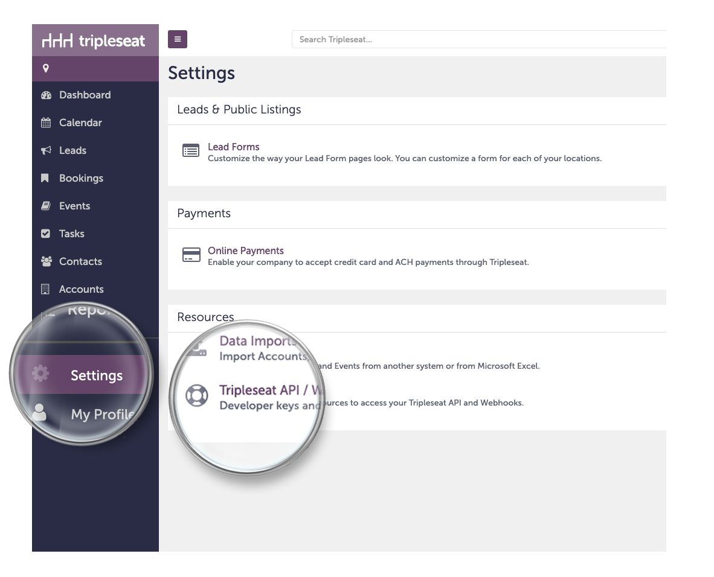
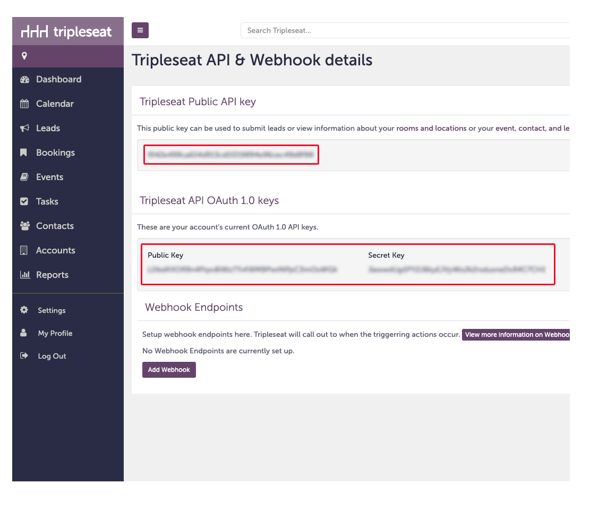

### Setup
1. Sign in to the [Tripleseat](https://login.tripleseat.com/)
2. Click on 'Settings' in the navigation bar
3. Click on 'Tripleseat API / Webhooks'
4. Send the **Tripleseat Public API Key** and the key-pair under **Tripleseat API OAuth 1.0 keys** to your account manager

